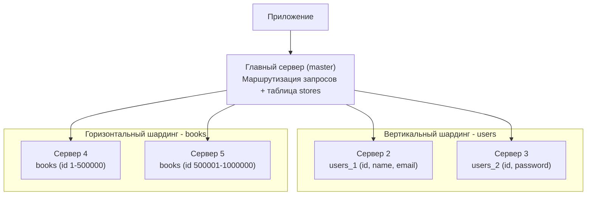

# Домашнее задание к занятию «Репликация и масштабирование. Часть 2 - Мурашов Денис»

---

## Задание 1

**Активный master + пассивный slave**

Всю нагрузку обслуживает master, а slave держит копию данных и ждет в резерве.

1. Отказоустойчивость: если master выйдет из строя, slave можно сделать новым master.
2. Всегда есть актуальная резервная копия данных.
3. Бэкапы можно снимать со slave, не нагружая master.
4. Запись идет только в один сервер - конфликтов нет.

**Master + несколько slave**

Запись идет в master, а чтение распределяется между несколькими slave.

1. Сохраняются все преимущества первой схемы.
2. Нагрузка на чтение делится между несколькими slave - выше производительность.
3. Копий данных больше - выше отказоустойчивость: упадет один slave, останутся другие.

Первая схема нужна для надежности и резерва, вторая добавляет к этому масштабирование чтения.

---

## Задание 2

Вертикальный шардинг - это деление таблицы по столбцам, горизонтальный - по строкам. Части хранятся на разных серверах.

**Таблицы:**

- **users** - id, name, email, password
- **books** - id, title, author, year
- **stores** - id, name, city

**План шардинга:**

- users - вертикальный шардинг. Делим таблицу по столбцам на две, каждая на своем сервере:
  - `users_1 (id, name, email)` - часто используемые данные;
  - `users_2 (id, password)` - данные для входа.
- books - горизонтальный шардинг. Таблица большая, делим ее по строкам (по диапазону id) на два сервера:
  - `books` с id от 1 до 500000;
  - `books` с id от 500001 до 1000000.
- stores - не шардируем. Таблица маленькая, храним ее целиком на главном сервере.

**Разграничение между серверами:**

| Сервер | Что хранит |
|---|---|
| Главный (master) | таблица stores, распределение запросов |
| Сервер 2 | users_1 (id, name, email) |
| Сервер 3 | users_2 (id, password) |
| Сервер 4 | books (id 1–500000) |
| Сервер 5 | books (id 500001–1000000) |

**Блок-схема:**

**Режимы работы серверов:**

- Главный сервер (master) - принимает запросы от приложения и направляет их на нужный сервер. Режим read/write.
- Серверы 2 и 3 (вертикальный шардинг users) - хранят свою часть столбцов. Режим read/write.
- Серверы 4 и 5 (горизонтальный шардинг books) - хранят свой диапазон строк. Режим read/write.
